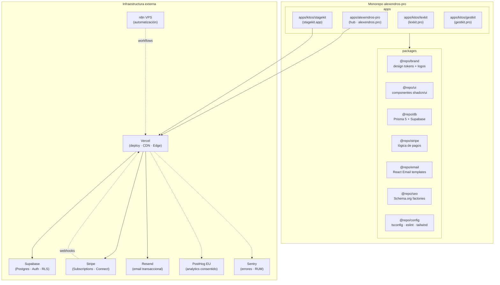

# Arquitectura de alexendros-pro

Documento de "cómo y por qué". Describe la forma del sistema, las decisiones cardinales y los puntos de extensión. Para el "qué", revisa el código y los ADR en `docs/adr/`.

## Visión general

Turborepo monorepo que alberga el hub **alexendros.pro** y los kits SaaS verticalizados (KitOS). Cada kit es una app Next.js 16 independiente con deploy en Vercel (región mad1). Comparten paquetes de infraestructura via workspace pnpm.



## Capas de cada app Next.js

### App Router (`app/`)
- Rutas como directorios. `layout.tsx` aplica fuentes Geist + clase `dark` (Vergina Imperial).
- Server Components por defecto. `"use client"` solo para interactividad browser.
- `metadata` por ruta para SEO; `layout.tsx` raíz expone `metadataBase`.
- `proxy.ts` (no `middleware.ts`) para auth SSR — patrón Next.js 16.

### API Layer (`app/api/`)
- `app/api/trpc/[trpc]/route.ts` — tRPC v11 con `fetchRequestHandler`
- `app/api/webhooks/stripe/route.ts` — webhook con verificación de firma
- `app/api/consent/route.ts` — AEPD ConsentLog
- Rate limiting Upstash Redis en `/api/trpc/*` y `/api/auth/*`

### Shared packages

| Package | Responsabilidad |
|---------|----------------|
| `@repo/brand` | Tokens OKLCH, logos SVG, fuentes — fuente de verdad visual |
| `@repo/ui` | Componentes shadcn/ui sobre tokens Vergina Imperial |
| `@repo/db` | Schema Prisma 5, factories Supabase (`createServerClient`, `createBrowserClient`) |
| `@repo/stripe` | Lógica de pagos compartida, helpers de webhooks |
| `@repo/email` | Templates React Email para transaccionales |
| `@repo/seo` | Factories Schema.org (JSON-LD) |
| `@repo/config` | `tsconfig.base.json`, `eslint.config.mjs`, tailwind base |

## Flujo de datos (petición autenticada)

```
Navegador → Vercel Edge → proxy.ts (Supabase session refresh)
          → RSC/tRPC procedure → createCallerFactory (server-side)
          → Prisma query (DATABASE_URL pooler 6543)
          → Supabase Postgres (RLS aplicado)
          → RSC serializa → streamed to client
```

## Decisiones cardinales

Ver `docs/adr/` para justificación detallada de cada una:

- **ADR-0001** — Next.js 16 + Turborepo vs alternativas
- **ADR-0002** — Supabase + Prisma 5 vs Neon+Drizzle / PlanetScale
- **ADR-0003** — Stripe Connect Express para suscripciones y afiliados
- **ADR-0004** — tRPC v11 como API layer type-safe
- **ADR-0005** — Vergina Imperial v0.2.2 como design system dark-first
- **ADR-0006** — Cookie banner bloqueante real (AEPD 2023)

## Puntos de extensión

- **Nuevo Kit**: seguir skill `/create-kit` — scaffolding en `apps/kitos/<slug>/`
- **Nuevo modelo DB**: `prisma migrate dev` — nunca editar en Supabase Studio
- **Nuevo tRPC procedure**: añadir en `server/routers/`, registrar en `server/root.ts`
- **Nuevo token de design**: `packages/brand/tokens.ts` — nunca hardcodear colores

## Trade-offs aceptados

- **Prisma vs Drizzle**: Prisma elegido por madurez de migraciones con 11+ modelos. Evaluar Drizzle post-MVP si edge runtime se vuelve crítico.
- **Vendor lock-in Vercel**: aceptado por Remote Cache Turborepo gratuito + deploy previews por PR.
- **Supabase vs Neon**: Supabase elegido por Auth SSR out-of-box. Si Auth crece en complejidad, evaluar separar auth.
- **1 desarrollador**: decisions optimizadas para coste cognitivo bajo; complejidad accidental reducida al mínimo.

## Telemetría y observabilidad

- **Sentry** — errores server + client, RUM. PII anonimizado antes de enviar.
- **PostHog EU** — analytics consentido; inicializado solo tras `consent_given=1`.
- **Vercel Speed Insights** — Core Web Vitals en producción.
- **Lighthouse CI** — gating de performance en CI (≥90 obligatorio).

## Riesgos conocidos

- DNS desalineado entre Hostinger y Vercel rompería previews y producción.
- `SUPABASE_SERVICE_ROLE_KEY` bypasa RLS — uso estrictamente server-only.
- React 19 tiene límites en testing de async Server Components — ver configuración Vitest.
- Stripe Connect Express requiere KYC de afiliados — latencia en onboarding de partners.
